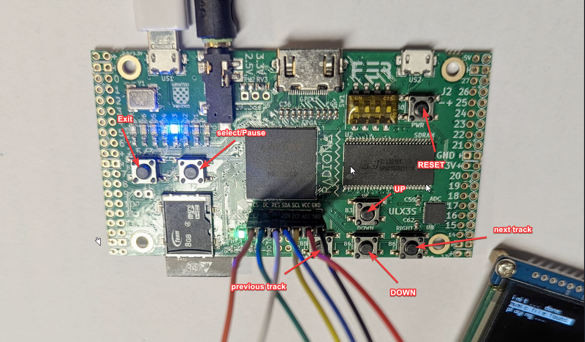

# 🎵 Lecteur Audio FPGA - ULX3S

**Auteur :** Mohammed Habbi  
**Formation :** 3ème année ISN - ENSEM Nancy  
**Projet :** Lecteur audio embarqué sur FPGA avec interface graphique OLED

---

## 📋 Description du projet

Lecteur audio multi-albums implémenté sur carte FPGA **ULX3S** (Lattice ECP5) avec :
- Processeur RISC-V 32 bits (Ice-V)
- Écran OLED 128×128 pixels grayscale
- Lecture audio streaming depuis carte SD
- Interface de navigation par boutons (7 boutons)
- Affichage des pochettes d'album
- 8 LEDs animées (chenillard hardware)

Le lecteur permet de naviguer dans des albums organisés en répertoires, avec contrôle complet de la lecture (pause, next/previous track, stop).

---

## ✨ Fonctionnalités

### Fonctionnalités de base ✅
- ✅ **Menu par album** : navigation dans 8 répertoires d'albums maximum
- ✅ **Lecture/pause** : contrôle de la lecture musicale (bouton toggle)
- ✅ **Arrêt** : retour au menu principal
- ✅ **Affichage d'image** : pochette d'album (grayscale 128×128 pixels)
- ✅ **Effet LED** : chenillard hardware pendant la lecture

### Fonctionnalités bonus ⭐
- ⭐ **Navigation piste suivante/précédente** : boutons dédiés (5 et 6)
- ⭐ **Effet LED** : animation pendant la musique (ecran ou LED ou les deux)
- ⭐ **Sons système** : clics de navigation + son de démarrage

---


## 🚀 Instructions de compilation

### Prérequis
- **Silice** (dernière version) : [GitHub Silice](https://github.com/sylefeb/Silice)
- **Toolchain RISC-V** : `riscv64-unknown-elf-gcc`
- **openFPGALoader** : pour programmer la carte
- **Carte ULX3S** (Lattice ECP5)

### Compilation complète

```bash
# Cloner le dépôt
git clone https://github.com/med-habbi/Silice/tree/draft
cd Silice\learn-silice\classroom\soc_wave_player

# Compilation hardware + firmware
make final FIRMWARE=step_final2

# Programmation en FLASH (permanent, survit au reboot)
openFPGALoader -f -b ulx3s BUILD_final/build.bit
```

🎮 Utilisation
Mapping des boutons

| Bouton | Menu Albums | Menu Pistes       | Lecture            | Pause            |
| ------ | ----------- | ----------------- | ------------------ | ---------------- |
| BTN 0  | -           | Retour menu album | -                  | -                |
| BTN 1  | -           | -                 | Stop (retour menu) | -                |
| BTN 2  | Valider     | Valider           | Pause              | Reprise          |
| BTN 3  | Haut ↑      | Haut ↑            | -                  | -                |
| BTN 4  | Bas ↓       | Bas ↓             | -                  | -                |
| BTN 5  | -           | -                 | Piste suivante →   | Piste suivante   |
| BTN 6  | -           | -                 | Piste précédente ← | Piste précédente |



💾 Préparation de la carte SD
Structure requise
```
/Album1/
  ├── song1.raw    # Audio 8-bit mono 48kHz
  ├── song2.raw
  ├── song3.raw
  └── cover.raw     # Image 128×128 grayscale
/Album2/
  ├── song1.raw
  └── cover.raw
/Album3/
  └── ...
/Sounds/
  ├── click.raw     # Son de clic (court)
  └── startup.raw   # Son de démarrage
```
  
Conversion image (PNG/JPG → RAW grayscale)
Avec GIMP (interface graphique) :
Ouvrir l'image

Image → Mode → Grayscale

Image → Scale Image : 128×128 pixels

File → Export As : cover.raw

Sélectionner Raw image data

Export


Paramètres obligatoires :

Taille : 128×128 pixels exactement

Format : Grayscale 8-bit (0-255)

Taille fichier : 16384 octets (128×128×1)

🔧 Configuration hardware
Périphériques mémoire mappés


| Adresse | Nom         | Description                               |
| ------- | ----------- | ----------------------------------------- |
| 0x10000 | LEDS        | 8 LEDs (bits 0-7)                         |
| 0x10002 | DISPLAY     | Contrôle OLED direct                      |
| 0x10004 | DISPLAY_RST | Reset OLED                                |
| 0x10020 | SDCARD      | Interface SD (CLK, MOSI, MISO, CS)        |
| 0x10040 | BUTTONS     | 7 boutons (bits 0-6)                      |
| 0x18000 | AUDIO       | Buffer audio (double buffer 2×512 octets) |


🔐 Dossier Secret
L'album 8 (/secret_folder) est verrouillé par défaut. Pour y accéder :

Sélectionnez le dossier secret dans le menu albums.

À l'écran de verrouillage, entrez la combinaison suivante (Hint: 6-3-5-4) :

BTN 6 (Suivant)

BTN 3 (Haut)

BTN 5 (Précédent)

BTN 4 (Bas)

Un son de succès (yaaay.raw) confirmera le déverrouillage.

